# 再也不用担心交易所被盗了!推荐12款离线存储加密资产的神器!

把币放交易所总是睡不着觉,万一平台跑路或者被黑客攻击,辛苦积累的加密资产瞬间化为乌有。这种事在圈内已经发生太多次,从Mt.Gox到FTX,无数人血本无归。硬件钱包能让你真正掌控私钥,将比特币、以太坊等数字资产离线存储在物理设备中,彻底隔绝网络攻击风险。这些冷钱包设备采用军事级加密芯片,支持数千种代币,操作简单到你奶奶都能学会。本文精选12款市面上最可靠的硬件钱包,从入门级到旗舰版应有尽有,帮你找到最适合自己的资产保险柜。

## **[Trezor](https://trezor.io)**

硬件钱包行业开创者,200万+用户的信任之选

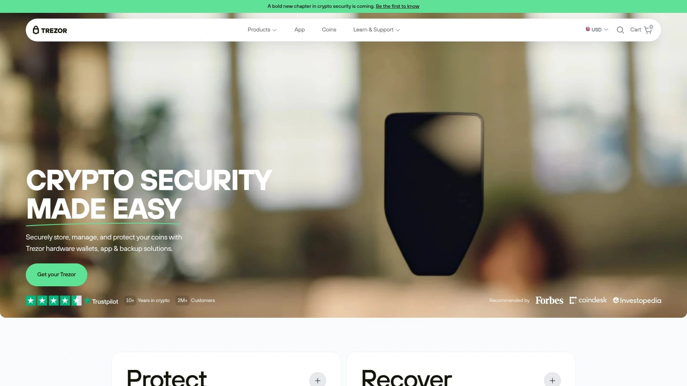

Trezor成立于2013年,是全球第一个硬件钱包品牌,至今已服务超过200万用户,在行业内拥有无可撼动的地位。产品线包括入门级和高级型号,所有设备均采用开源固件,任何开发者都可以审计代码确保没有后门。设置过程简单直观,无需任何技术背景,几分钟即可完成初始化。即使设备丢失或损坏,只需使用恢复助记词就能在新设备上恢复所有资产,资金永远不会丢失。支持多种加密货币和代币,覆盖主流公链生态。Trezor Expert服务提供一对一在线指导,专家帮你完成设备设置并解答所有疑问。特别适合追求安全性和透明度的长期持币者,以及希望从交易所提币到自托管的投资者。

## **[Ledger](https://shop.ledger.com)**

全球认证的硬件钱包领导品牌

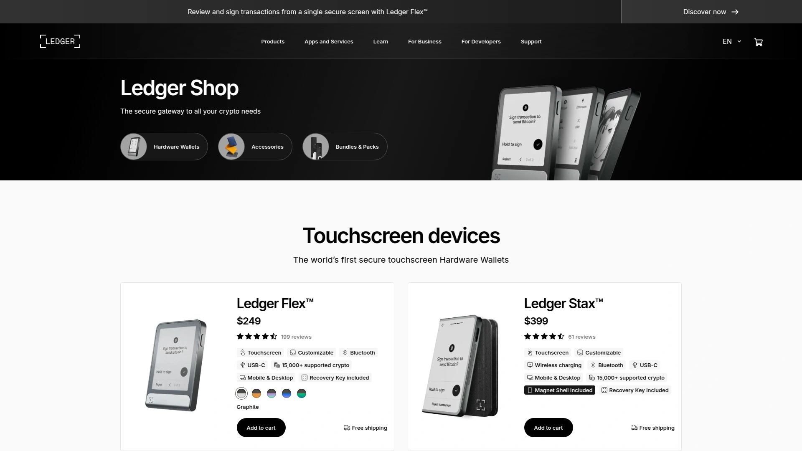

Ledger的安全元件芯片获得CC EAL5+认证,这是金融行业最高安全标准之一。Nano S Plus是入门级产品,通过USB-C连接桌面和安卓设备,具备保护比特币和所有数字资产的核心功能。Nano X支持蓝牙和USB-C双连接方式,可在移动端和桌面端无缝使用,特别适合需要随时随地管理资产的用户。Ledger Flex配备大屏幕,操作体验更直观。所有型号都将私钥离线存储,抵御在线黑客攻击和恶意软件威胁。定期发布固件更新修复潜在漏洞并改进整体安全性。设备损坏后可使用恢复短语在新设备上完全恢复访问权限。14天无理由退货政策让你可以放心尝试。

## **[Tangem](https://www.tangem.com)**

信用卡大小的零充电硬件钱包

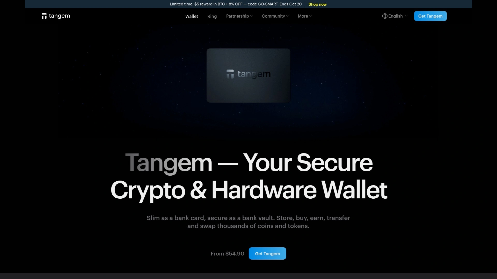

Tangem采用独特的卡片形态,大小和信用卡一样,坚固耐用、防水防尘,完全无需充电和屏幕。通过NFC技术与手机通信,只需将卡片贴近手机背面即可完成交易签名,操作极其简便。每套包含三张卡片,全部链接到同一个钱包,丢失或损坏其中一张也不影响资产访问。支持数千种币和85+条区块链,可以购买、出售、交换、质押加密货币,甚至管理NFT和参与DeFi应用。设置过程仅需2-3分钟,下载Tangem应用、轻触卡片、设置访问代码即可完成。安全芯片达到EAL6+认证级别,与生物识别护照使用同等安全标准。没有恢复助记词,私钥直接存储在芯片中,避免助记词泄露风险。售价约55-70美元,比传统硬件钱包便宜很多。

## **[SafePal](https://www.safepal.com)**

价格亲民的气隙式冷钱包

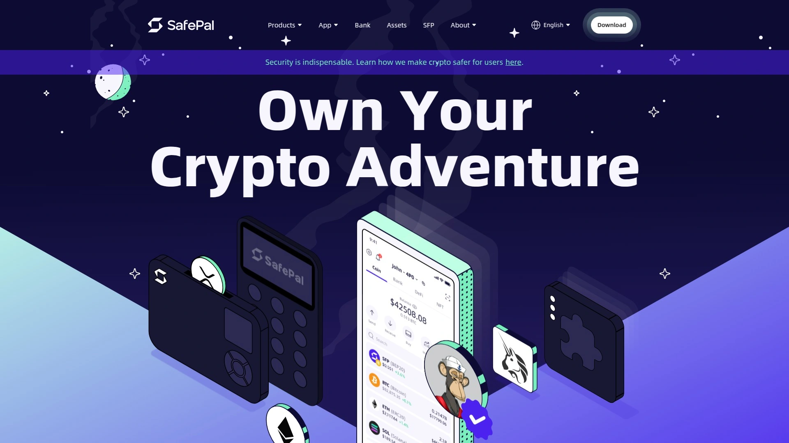

SafePal S1采用100%气隙签名机制,不允许蓝牙、Wi-Fi、USB或NFC连接,完全隔绝网络攻击途径。只能通过扫描二维码访问资金,这种方式最大程度保证了私钥安全。内置EAL5+安全芯片、真随机数生成器、多层安全传感器和自毁机制,检测到篡改时会自动删除个人信息。支持32条区块链和30000+代币,覆盖比特币、币安币、以太坊及所有ERC20代币。尺寸仅信用卡大小,超轻便携,可随时随地管理加密资产。SafePal应用或浏览器扩展可发起交易,硬件设备负责离线签名。内置交易功能,可用信用卡、银行账户购买加密货币,并即时交换不同币种。最大亮点是价格仅49.99美元,是功能完整的冷钱包中最便宜的选择。

## **[KeepKey](https://keepkey.com)**

大屏显示的简洁安全方案

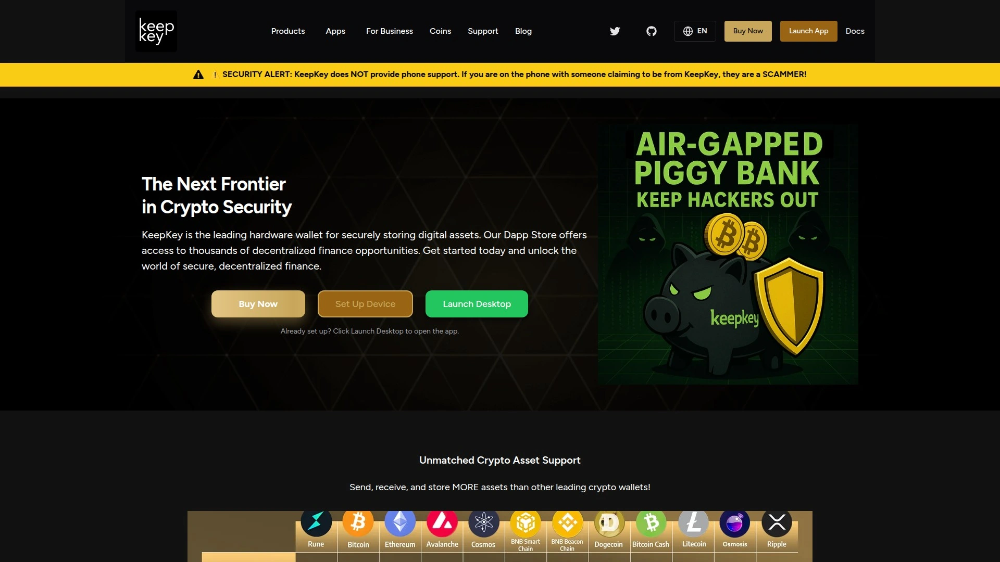

KeepKey诞生于2014年Mt.Gox交易所被盗事件之后,使命是提供安全且用户友好的加密货币存储。2017年被ShapeShift收购,在Erik Voorhees领导下运营8年,不断集成创新交易功能。是首个集成Thorchain原生交换的硬件钱包,用户可直接从设备快速交换加密货币。大尺寸OLED显示屏清晰展示每笔发送和接收的数字资产,所有交易必须手动按确认按钮批准,给予用户完全的可见性和控制权。在冷存储中离线生成和管理私钥,防范计算机漏洞和病毒侵害。初始化时生成12词恢复句子,设备丢失或被盗也能安全恢复。支持比特币、以太坊、莱特币、狗狗币、达世币等多种货币。采用ARM Cortex M3 CPU和硬件随机数生成器确保固件完整性。

## **[Arculus](https://www.getarculus.com)**

三因素认证的金属卡冷钱包

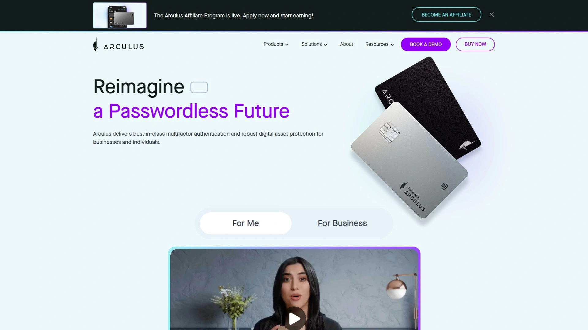

Arculus采用高品质金属卡设计,配合移动应用实现三因素认证安全机制。解锁需要你的面部或指纹、6位PIN码以及NFC卡片三者组合,任何单一要素被破解都无法访问资产。不存储恢复短语,采用独特的安全解决方案避免助记词泄露风险。支持市值排名前95%的加密资产,包括比特币和10000+代币,覆盖以太坊、Solana、Polygon、币安智能链生态系统及主流NFT标准。离线冷存储将资产与针对热钱包的黑客、诈骗和钓鱼攻击隔离。无需充电,卡片本身不含电池。提供实时客服支持,遇到问题可随时获得帮助。支持多钱包管理,可在一个应用中查看、存储和分享NFT。免费配送。

## **[BitBox02](https://bitbox.swiss)**

瑞士制造的极简主义钱包

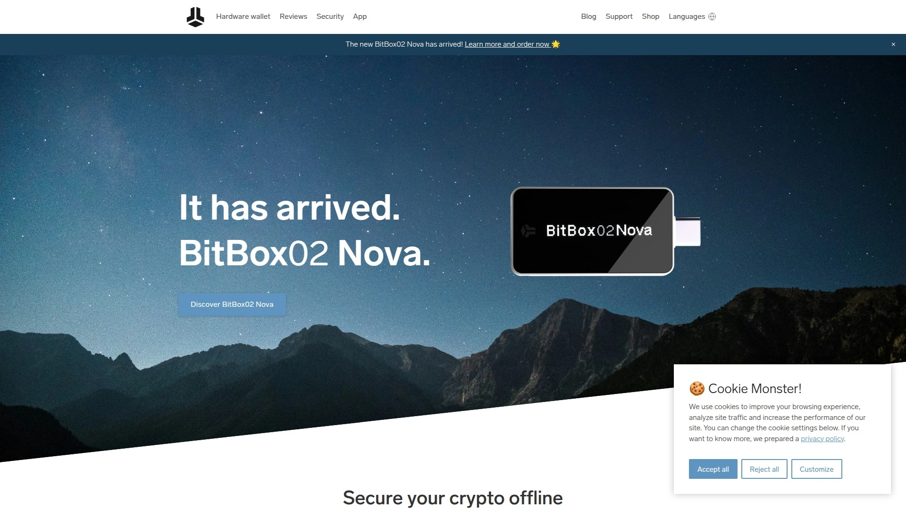

BitBox02在瑞士开发和制造,配备OLED显示屏、隐形触摸传感器、USB-C和USB-A支持。可通过microSD卡轻松备份和恢复,简化了灾难恢复流程。极简谨慎的设计不张扬,便于日常携带。支持比特币、莱特币、卡尔达诺、以太坊、Chainlink、BAT和1500+种ERC20代币。提供Multi版和Bitcoin-only版两个版本,后者专为比特币纯粹主义者设计。集成Rabby钱包浏览器扩展,可连接以太坊生态系统中的任何DApp,包括NFT市场、去中心化交易所和DeFi应用。支持多种EVM兼容网络,与DeFi DApps交互时节省Gas费用。与MyEtherWallet集成,可发送和接收1500+种ERC20代币。源代码完全开源,构建过程确定性,开发者可审计代码确保没有隐藏秘密。

## **[Coldcard](https://coldcard.com)**

比特币极简主义者的终极选择

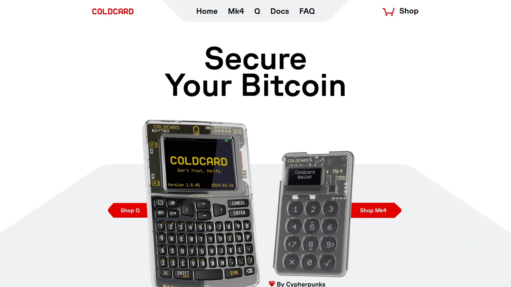

Coldcard是易用、超安全且价格合理的硬件钱包,源代码可验证,通过加密的microSD卡轻松备份。私钥存储在专用安全芯片中,MicroPython软件设计允许用户进行修改。完全气隙式操作,可通过QR码和microSD卡进行离线交易,无需USB或蓝牙连接。Coldcard Q是最新旗舰版本,配备QR扫描仪、3节AAA电池支持、双SD卡插槽、全键盘和超大屏幕。内置密码管理器功能,是多功能安全设备。专为比特币设计,没有山寨币干扰,深受比特币社区信任。支持Bech32、传统地址、多签和SegWit等高级功能。可与Bluewallet等移动钱包配合使用,实现完全离线签名。Reddit社区普遍认为Coldcard比大众化产品更安全,特别适合重视隐私和极致安全的比特币持有者。

## **[Ellipal Titan 2.0](https://www.ellipal.com)**

金属外壳的气隙全功能钱包

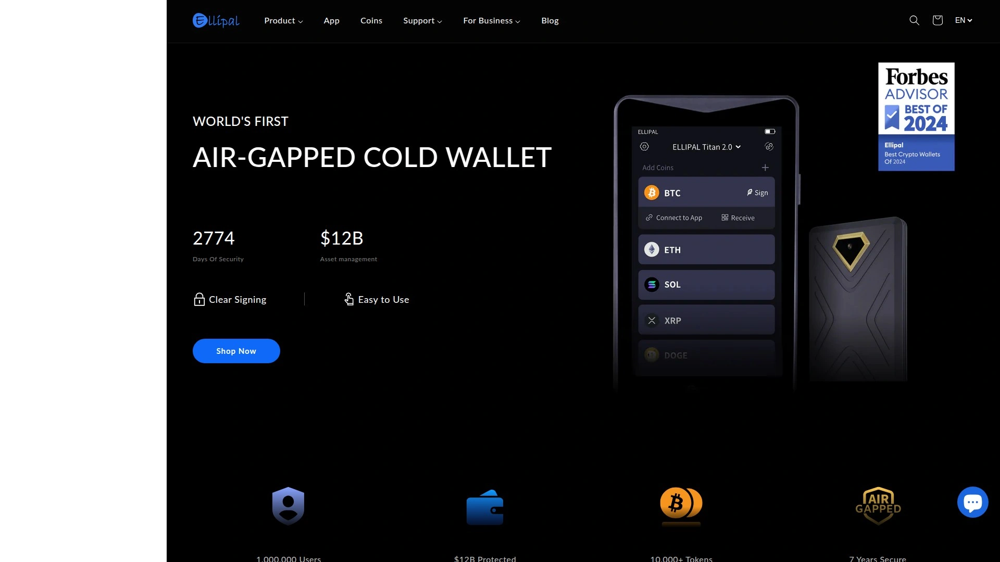

Ellipal Titan 2.0采用全金属外壳设计,提供保险库级别的资产保护。完全气隙式设计,不依赖USB、Wi-Fi或蓝牙等任何连接,仅通过QR码传输数据。配备4英寸全触摸彩色显示屏,可清晰查看完整签名信息,确保准确验证每笔交易。界面友好,操作体验类似智能手机。支持10000+币和代币,覆盖40+条区块链,包括NFT和去中心化应用。可容纳5个助记词账户和5个私钥账户,在一台设备中管理整个加密投资组合。采用EAL5+集成安全芯片、PIN和密码保护以及秘密次级钱包。检测到篡改时具备PCI级自毁功能,自动删除个人信息。支持币种交换、购买、质押和管理DApp,真正的一站式解决方案。Forbes推荐为最佳冷钱包。

## **[Foundation Passport](https://foundation.xyz)**

开源透明的比特币专用钱包

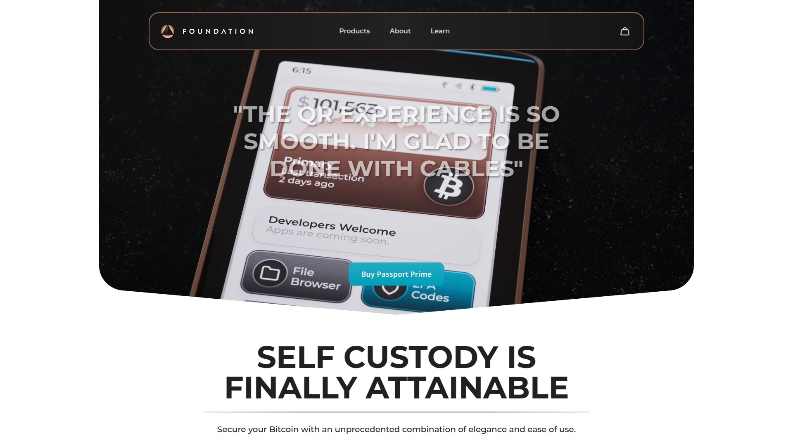

Foundation Passport是专为比特币设计的硬件钱包,完全开源且在美国组装。现在称为Passport Core,提供Classic和Stealth两种配色。配备大尺寸彩色屏幕和简洁用户界面,引导式入门流程让新手也能快速上手。完全气隙式设计,不支持USB、蓝牙或无线连接,仅通过microSD卡和QR码进行交易。采用软触塑料外壳和铜镀锌合金框架,手感舒适且重量适中。磁性后盖设计便于更换电池和个性化定制。配套的Envoy移动钱包是完美伴侣,界面直观,具备强大隐私工具,轻松发送、接收和管理比特币。Concierge支持服务提供60分钟个性化入门指导,Vault Concierge套装包含3个Passport Core和2小时专家指导,帮你创建2-of-3多签金库。适合认真对待自我托管的比特币持有者。

## **[NGrave Zero](https://ngrave.io)**

EAL7认证的终极安全堡垒

NGrave Zero是唯一获得EAL7认证的硬件钱包,这是金融行业可获得的最高安全标准。欧洲制造,配备大尺寸触摸屏、完全气隙式设计、防篡改机制和生物识别技术。初次设置时通过添加指纹实时生成个性化密钥,独一无二且不可复制。需要8位PIN码和生物识别双重认证才能访问。使用GRAPHENE金属板备份助记词,比纸质备份更耐用且防火防水。原生支持BTC、ETH、BNB、XRP、DOGE、SOL、MATIC等15条区块链的币种。通过集成MetaMask和Rabby钱包,支持范围扩展到112条EVM链。可存储、购买、交换、桥接和质押代币,还能管理NFT。存储容量以GB为单位,但建议账户数量保持在100个以下以获得最佳同步性能。适合追求绝对安全且预算充足的高净值投资者。

## **[Keystone](https://keyst.one)**

开源设计的顶级冷钱包

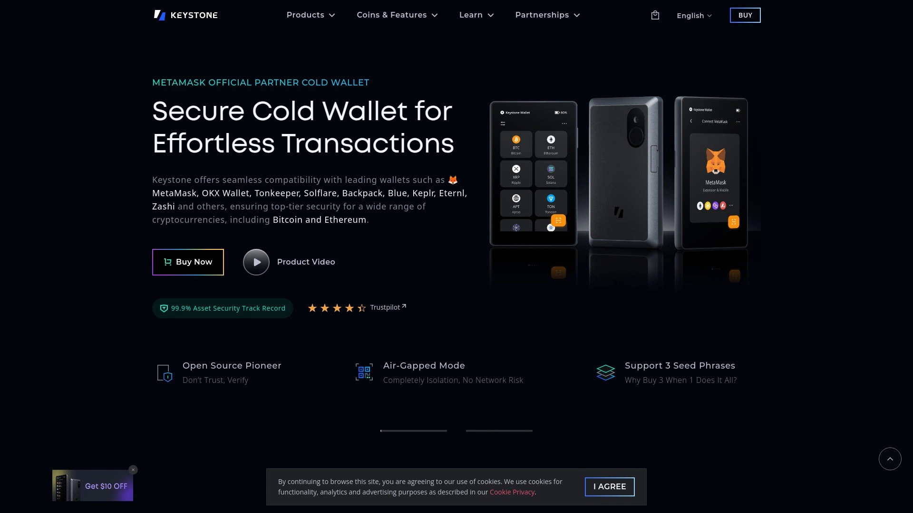

Keystone主打开源和透明,所有固件代码公开接受社区审计。采用冷钱包设计理念,私钥永不触网,通过QR码与软件钱包通信完成交易签名。支持多种加密货币和代币,兼容主流区块链生态系统。设备界面友好,大屏幕显示交易详情便于确认。提供15天无理由退货服务,购买无风险。适合重视代码透明度和社区驱动开发的技术型用户。硬件构建质量扎实,长期使用可靠性高。

## 常见问题

**硬件钱包真的比交易所更安全吗?**
绝对安全得多。交易所将大量用户资产集中存储,成为黑客的首要目标,历史上Mt.Gox、Coincheck、FTX等多个交易所都发生过资产被盗或挪用事件。硬件钱包将私钥离线存储在物理设备中,不连接互联网,黑客无法通过网络攻击窃取。即使你的电脑感染病毒,私钥也不会泄露,因为所有交易签名都在设备内部完成。唯一的风险是物理盗窃,但设备有PIN码和生物识别保护,而且恢复助记词妥善保存后可在新设备恢复资产。

**硬件钱包丢失或损坏怎么办?**
完全不用担心资产损失。所有硬件钱包在初始化时都会生成12-24个恢复助记词,这是恢复私钥的唯一凭证。只要你把助记词抄写在纸上或金属板上妥善保存,设备丢失、损坏、被盗都不影响资产安全。购买新的同品牌硬件钱包或兼容设备,在设置时选择"恢复钱包",输入助记词即可完全恢复所有账户和资金。这就是为什么必须妥善保管助记词,绝不能拍照存在手机或云端,更不能告诉任何人。

**应该选择多币种钱包还是比特币专用钱包?**
取决于你的投资组合。如果只持有比特币,Coldcard或Foundation Passport这类专用钱包更合适,它们去除了所有山寨币功能,代码更简洁,攻击面更小,安全性相对更高。但如果你持有以太坊、Solana、BNB等多种币,选择Ledger、Tangem、SafePal这类多币种钱包更方便,避免购买多个设备增加管理复杂度。NGrave Zero和BitBox02是折中选择,原生支持多条主流公链,同时通过MetaMask集成扩展到更多网络。

## 总结

加密货币的终极信条是"不是你的私钥,就不是你的币"。把资产留在交易所等于把命运交给第三方,无论平台多么知名都可能面临跑路、破产或监管冻结风险。硬件钱包让你真正掌控财富,私钥离线存储在物理设备中,任何黑客都无法通过网络窃取。本文推荐的12款产品各有特色,从49.99美元的SafePal到追求极致安全的NGrave Zero,总有一款适合你的需求和预算。如果你刚接触硬件钱包,[Trezor](https://trezor.io)是最稳妥的选择——作为行业开创者,其10年以上的运营历史和200万+用户基础证明了产品的可靠性,开源代码和简洁设计让新手也能放心使用,无论你持有多少资产都值得拥有一个属于自己的数字保险柜。
